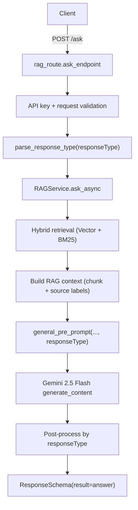

# RAG Implementation V2

Concise reference for the current RAG pipeline after the v2 refactor, with direct comparison to v1.

---

## What V2 Is

V2 is a simplified, production-oriented RAG flow for `POST /ask`:

- no Redis memory path
- no streaming path
- no LLM reranking pass
- one shared Chroma collection for all subjects
- `responseType`-aware generation (`normal` / `komplex`)
- stronger output guards (especially for `normal`)

---

## V1 vs V2 (Key Differences)

| Area | V1 | V2 |
|---|---|---|
| Endpoint behavior | Streaming text response | Single JSON response via `ResponseSchema(result=...)` |
| Redis/memory | Designed but disabled | Removed from runtime path |
| Retrieval flow | Hybrid retrieval + LLM rerank | Hybrid retrieval only (vector + BM25) |
| Collection strategy | Subject-named collection (`biology`) | Single shared collection (`komplex_rag`) |
| Embedding model | `all-MiniLM-L6-v2` | `paraphrase-multilingual-MiniLM-L12-v2` |
| Prompt routing | Basic RAG prompt | Reuses Gemini preprompt templates by `responseType` |
| `responseType` support in `/ask` | Mostly unused in earlier RAG path | Parsed and enforced in route + service |
| `komplex` output reliability | Not strict | JSON extraction + structure validation + safe fallback |
| `normal` output reliability | Could leak JSON/code fences | JSON-artifact guard + markdown-only reprompt |
| Logging | Minimal | Structured request/retrieval/generation logs |

---

## Current Runtime Flow (V2)

### Post-process rules

- `responseType=komplex`
  - extract JSON candidate
  - validate basic TopicContent structure (`[{type, props}, ...]`)
  - fallback to safe TopicContent JSON if invalid

- `responseType=normal`
  - enforce markdown-only contract in prompt
  - detect accidental JSON/code-fenced output
  - reprompt once with strict markdown-only instruction
  - fallback to safe error message if still invalid

---

## Why V2 Is Better

1. **Lower latency and cost**
   - Removed rerank pass (one less Gemini call per request).

2. **Cleaner architecture**
   - Single retrieval pipeline and single collection.
   - No dead Redis/memory branches in request path.

3. **More predictable formatting**
   - `responseType` now directly controls generation and output handling.
   - Guardrails prevent `normal` mode from returning JSON blocks.

4. **Better multilingual retrieval baseline**
   - Upgraded to multilingual embedding model (`L12` variant).

5. **Easier debugging**
   - Logs include request metadata and retrieval stats (`vector`, `bm25`, merged count, timing, sources).

---

## Important Notes for Operators

- V2 uses collection name `komplex_rag` in `./chroma_db`.
  - If old data was indexed under `biology`, rebuild or migrate as needed.

- On startup, all `app/docs/*.txt` are loaded and embedded into one index.
  - Retrieval does not require subject routing.

---

## Current Source of Truth (Code)

- `app/rag/rag_service.py`
- `app/routes/rag_route.py`
- `app/instructions/rules.py`
- `app/instructions/templates.py`
- `app/app.py`

